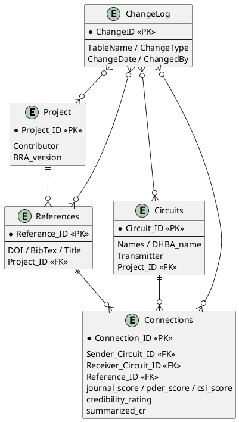

# WholeBIFRDB-build-v3

Build pipeline for WholeBIF-RDB (Whole Brain Interconnection Fluency Research Database).
Covers the full workflow from PubMed literature collection and LLM-based projection
extraction through DHBA ID assignment, reference enrichment, credibility scoring, and
PostgreSQL ingestion.

---

## Pipeline overview

```
pubmed_projection_miner_gpt52.py
        |
        v  out_gpt52.csv  (LLM extraction output)
        |  sender/receiver in natural language
        |  DOI and BibTeX empty, scores not yet computed
        |
        v  [Step 1]  enrich_dhba.py
                     sender/receiver -> dhbasid/dhbarid
                     (fuzzy match against BrainRegions.csv)
        |
        v  [Step 2]  enrich_references.py
                     PMID -> DOI / BibTeX
                     (NCBI efetch + CrossRef)
        |
        v  [Step 3]  score_records.py
                     journalscore / methodscore / citationscore
        |
        v  [Step 4]  compute_summarized_cr.py
                     credibility_rating (mean of three scores)
                     summarized_cr (Bayesian update for duplicate projections)
        |
        v  step4_cr.csv  (same column layout as cleaned_sample.csv)
        |
        v  [Step 5]  import_bdbra_into_wholebif_v4_enhanced_patched.py
                     upsert into PostgreSQL (WholeBIF-RDB)

pipeline.py runs Steps 1 through 5 in sequence.
```

---

## Directory layout

```
WholeBIFRDB-build-v3/
|
+-- src/
|   +-- pipeline.py                                        orchestrator for Steps 1-5
|   |
|   |   -- LLM extraction --
|   +-- pubmed_projection_miner_gpt52.py                   extract projections with GPT-5.2 -> out_gpt52.csv
|   +-- batch_pubmed_until_target_sharded.py               sharded batch runner
|   +-- prompts_gpt52.py                                   prompt definitions for GPT-5.2
|   +-- openai_client.py                                   OpenAI Responses API wrapper
|   +-- method_lexicon.py                                  experimental method keyword dictionary
|   +-- doi_utils.py                                       DOI and BibTeX retrieval utilities
|   |
|   |   -- PubMed collection --
|   +-- pubmed_clients.py                                  PubMed / EuropePMC API clients
|   +-- harvest_pubmed_projections_pro_v2.py               full-text collection (~200,000 records)
|   +-- harvest_pubmed_projections_pro_nofulltext_fast_split_2.py  abstract-only collection (~130,000 records)
|   |
|   |   -- Steps 1-5 --
|   +-- enrich_dhba.py                                     [Step 1] attach DHBA IDs
|   +-- enrich_references.py                               [Step 2] fill DOI and BibTeX from PMID
|   +-- score_records.py                                   [Step 3] compute three credibility scores
|   +-- compute_summarized_cr.py                           [Step 4] Bayesian summarized_cr
|   +-- import_bdbra_into_wholebif_v4_enhanced_patched.py  [Step 5] CSV -> PostgreSQL
|
+-- notebooks/
|   +-- citation_sentiment_prod_plus_transformers.ipynb
|   +-- citation_sentiment_refaware_basic_v2.ipynb
|
+-- tools/
|   +-- score_pder_with_claude_api.py                      batch PDER scoring via Claude API
|   +-- score_citation_sentiment.py                        batch CSI scoring via Semantic Scholar + Claude API
|
+-- tests/
|   +-- conftest.py
|   +-- test_credibility.py
|   +-- test_converter.py
|   +-- test_pipeline.py
|
+-- data/
|   +-- dhba/
|       +-- BrainRegions.csv                               DHBA region name master (3,435 entries)
|
+-- docs/
|   +-- score_basement.md                                  score definitions and rationale
|
+-- sample/
|   +-- out_gpt52.csv                                      sample output from pubmed_projection_miner_gpt52.py
|   +-- cleaned_sample.csv                                 sample output after Step 4
|
+-- pyproject.toml
+-- CHANGELOG.md
+-- README.md
```

---

## CSV column changes across steps

### out_gpt52.csv (Step 0, immediately after extraction)

| Column | State |
|---|---|
| sender / receiver | natural language text from the paper |
| dhbasid / dhbarid | empty (filled in Step 1) |
| DOI / BibTex | empty (filled in Step 2) |
| journalscore / methodscore / citationscore | absent (added in Step 3) |
| credibility_rating / summarized_cr | absent (added in Step 4) |

### step4_cr.csv (Step 4 output, sent to the database in Step 5)

```
sender, receiver, dhbasid, dhbarid, reference, journal, DOI, Taxon, Method,
Pointer, Figure, journalscore, methodscore, citationscore, BibTex,
credibility_rating, summarized_cr
```

---

## Step descriptions

### Step 1: enrich_dhba.py

Matches the sender and receiver strings against `data/dhba/BrainRegions.csv` (3,435 entries)
using rapidfuzz WRatio scoring and writes the best-matching Circuit ID into dhbasid and dhbarid.
Rows with match scores below `--min-score` (default 60) are left empty.

```bash
python src/enrich_dhba.py \
  --input   data/out_gpt52.csv \
  --regions data/dhba/BrainRegions.csv
```

### Step 2: enrich_references.py

Retrieves DOIs in batches of 20 PMIDs per request via NCBI efetch (XML), then fetches BibTeX
for each DOI from CrossRef using the habanero library.
Setting `NCBI_API_KEY` raises the rate limit from 3 to 10 requests per second.

```bash
export NCBI_API_KEY="your-key"   # optional
python src/enrich_references.py --input data/out_gpt52.csv
```

### Step 3: score_records.py

Computes three scores per row. For full definitions and rationale see
[docs/score_basement.md](docs/score_basement.md).

| Score | Method |
|---|---|
| journalscore | 1.0 for peer-reviewed journals, 0.5 for preprints (bioRxiv, medRxiv, arXiv, etc.) |
| methodscore | keyword match against a ranked table of neuroscience methods (0.15 to 1.00) |
| citationscore | mean sentiment score from abstracts of up to 5 citing papers, analyzed by Claude API |

citationscore procedure:
1. Retrieve citing PMIDs via NCBI elink (pubmed_pubmed_citedin), up to 5 records.
2. Fetch each abstract via NCBI efetch.
3. Send all abstracts to Claude API (claude-haiku) in one request and receive a score per abstract.
4. Return the mean of the received scores.

`ANTHROPIC_API_KEY` must be set for citationscore. If the variable is absent the score defaults to 0.5.

```bash
export ANTHROPIC_API_KEY="your-key"
python src/score_records.py --input data/out_gpt52.csv

# skip NCBI and Claude API calls
python src/score_records.py --input data/out_gpt52.csv --skip-citation
```

Selected methodscore reference values:

| Score | Method category |
|---|---|
| 1.00 | EM connectomics |
| 0.97 | Monosynaptic viral retrograde tracing (delta-G rabies, PRV-Bartha) |
| 0.95 | Anterograde classical tracer (BDA, PHA-L, WGA-HRP) |
| 0.93 | Retrograde classical tracer (CTB, Fluoro-Gold, RetroBeads) |
| 0.88 | Optogenetic circuit mapping (ChR2 + patch clamp) |
| 0.85 | Polysynaptic viral tracing / paired patch clamp |
| 0.75 | Chemogenetics (DREADDs) |
| 0.45 | DTI / diffusion MRI tractography |
| 0.32 | Resting-state fMRI |
| 0.20 | Review / meta-analysis |
| 0.15 | Textbook description |

### Step 4: compute_summarized_cr.py

Computes `credibility_rating` (simple mean of the three scores) and `summarized_cr`
for every row.

Single record (sender+receiver pair appears once):

```
summarized_cr = (journalscore + methodscore + citationscore) / 3
```

Multiple records (same sender+receiver pair appears more than once) — Bayesian update:

Prior: Beta(alpha=1, beta=1), uniform, no prior knowledge assumed.
Records within the same group are processed in order. Each record's credibility_rating
is treated as a success probability and used to update the posterior:

```
alpha  <-  alpha + credibility_rating
beta   <-  beta  + (1 - credibility_rating)
summarized_cr  =  alpha / (alpha + beta)
```

The more records that report a projection with high credibility, the closer
summarized_cr converges to 1.0. Conflicting records pull it toward an intermediate
value. With few records the prior (equivalent to 0.5) has a strong regularizing effect.

Example: CA1 -> DG projection reported in three papers.

| Record | credibility_rating | alpha | beta | summarized_cr |
|---|---|---|---|---|
| Paper A (EM, highly cited) | 0.917 | 1.917 | 1.083 | 0.639 |
| Paper B (DTI, moderately cited) | 0.683 | 2.600 | 1.400 | 0.650 |
| Paper C (fMRI, rarely cited) | 0.373 | 2.973 | 2.027 | 0.595 |

```bash
python src/compute_summarized_cr.py --input data/step3_scored.csv
```

### Step 5: import_bdbra_into_wholebif_v4_enhanced_patched.py

Reads step4_cr.csv and upserts rows into `references_tbl` and `connections`.
The `summarized_cr` value written by compute_summarized_cr.py is used as-is.
Falls back to the simple mean when that column is absent.

| CSV column | Database field |
|---|---|
| journalscore | journal_score |
| methodscore | pder_score |
| citationscore | csi_score |
| credibility_rating | credibility_rating |
| summarized_cr | summarized_cr |

```bash
python src/import_bdbra_into_wholebif_v4_enhanced_patched.py \
  --csv      data/step4_cr.csv \
  --host     localhost \
  --port     5432 \
  --dbname   wholebif_rdb \
  --user     wholebif \
  --password your-password
```

---

## Running the full pipeline

```bash
python src/pipeline.py \
  --input    data/out_gpt52.csv \
  --regions  data/dhba/BrainRegions.csv \
  --host     localhost \
  --dbname   wholebif_rdb \
  --user     wholebif \
  --password your-password
```

Resume from a specific step (requires intermediate files in `work/`):

```bash
python src/pipeline.py \
  --input      data/out_gpt52.csv \
  --regions    data/dhba/BrainRegions.csv \
  --start-step 4 \
  --host localhost --dbname wholebif_rdb --user wholebif --password your-password
```

Check the final CSV without importing into the database:

```bash
python src/pipeline.py \
  --input    data/out_gpt52.csv \
  --regions  data/dhba/BrainRegions.csv \
  --dry-run \
  --skip-citation
```

Intermediate files saved under `--work-dir` (default: `./work/`):

```
work/
  step1_dhba.csv      after Step 1
  step2_refs.csv      after Step 2
  step3_scored.csv    after Step 3
  step4_cr.csv        after Step 4  (input for Step 5)
```

---

## Setup

```bash
git clone https://github.com/asuparayuta/WholeBIFRDB-build-v3.git
cd WholeBIFRDB-build-v3
pip install rapidfuzz habanero requests psycopg2-binary
```

Required environment variables:

| Purpose | Variable |
|---|---|
| GPT-5.2 projection extraction | OPENAI_API_KEY |
| citationscore (Claude API) | ANTHROPIC_API_KEY |
| NCBI rate limit increase (optional) | NCBI_API_KEY |

---

## Database schema

Tables in WholeBIF-RDB (PostgreSQL):

| Table | Content |
|---|---|
| Project | project ID, contributor, BRA version |
| References | DOI, BibTeX, title, authors, journal |
| Circuits | circuit ID, name, DHBA name, neurotransmitter |
| Connections | sender/receiver IDs, scores, pointer, figure |
| Settings | WholeBIF file ID |
| ChangeLog | change history for all tables |

Key fields in the Connections table:

```
Sender_Circuit_ID        circuit ID of the projection origin  (= dhbasid)
Receiver_Circuit_ID      circuit ID of the projection target  (= dhbarid)
Reference_ID             source reference ID, format: FamilyName_YYYY
Taxon                    experimental species
Measurement_method       experimental method
Pointers_on_Literature   verbatim evidence text
Pointers_on_Figure       related figure number
journal_score            journalscore  (peer-reviewed: 1.0 / preprint: 0.5)
pder_score               methodscore   (projection detection capability of the method)
csi_score                citationscore (citation sentiment score)
credibility_rating       mean of the three scores above
summarized_cr            Bayesian-integrated overall credibility score
```

<details>
<summary>ER diagram (PlantUML)</summary>



</details>

---

## Tests

```bash
python -m pytest tests/ -v
python -m pytest tests/ --cov=src --cov-report=term-missing
```

---

## Changelog

[CHANGELOG.md](CHANGELOG.md)

---

## License

MIT — see [LICENSE](LICENSE)
